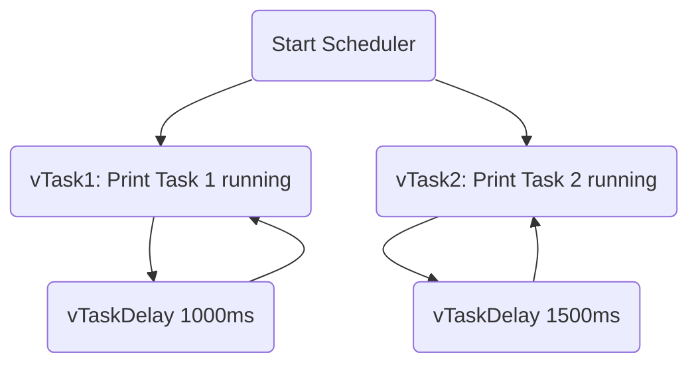

# Simple FreeRTOS Scheduler Project


## 📌 Project Overview
This project demonstrates a **basic FreeRTOS task scheduler** setup using **Visual Studio 2022** and the **FreeRTOS Win32-MSVC demo port**.  
It runs **two tasks** (`Task1` and `Task2`) that execute independently without requiring any hardware.

---

## 🛠️ Technical Details

### 1. Development Environment
- **IDE**: Visual Studio 2022 (Community Edition)
- **Operating System**: Windows 10/11
- **Target Platform**: Win32 Simulator (FreeRTOS WIN32-MSVC port)
- **RTOS**: FreeRTOS (cloned with `--recurse-submodules` to include FreeRTOS-Kernel)

### 2. Project Structure
- **main.c**: Contains all user code for task creation and scheduling.
- **FreeRTOS/Source**: Contains the FreeRTOS kernel source files.
- **FreeRTOSConfig.h**: Configures the behavior of FreeRTOS for this demo.

### 3. Tasks Implemented
- **Task 1**:
  - Function: `vTask1`
  - Prints: `Task 1 running`
  - Delay: 1000 milliseconds between prints (`vTaskDelay`).
- **Task 2**:
  - Function: `vTask2`
  - Prints: `Task 2 running`
  - Delay: 1500 milliseconds between prints (`vTaskDelay`).

### 4. How It Works
- **xTaskCreate()** is used to create each task with:
  - Task function pointer
  - A name
  - Stack size (minimal stack size)
  - Priority
- **vTaskStartScheduler()** is called to start FreeRTOS multitasking.
- Each task uses **vTaskDelay()** to yield the CPU voluntarily.
- The FreeRTOS **Win32 port** internally uses Windows threads to simulate RTOS task switching.
- Hook functions like `vApplicationTickHook()` and `vApplicationDaemonTaskStartupHook()` are implemented but left empty for future extensions.

Since it’s on a **Windows host**, no embedded hardware or debugging tools are needed.

### 5. Key FreeRTOS Functions Used
| Function | Purpose |
|----------|---------|
| `xTaskCreate()` | Creates a new task |
| `vTaskDelay()` | Delays a task without blocking the scheduler |
| `vTaskStartScheduler()` | Starts the FreeRTOS scheduler |
| `vApplicationTickHook()` | User hook function called from every RTOS tick interrupt |
| `vApplicationDaemonTaskStartupHook()` | User hook function after scheduler starts |
| `ulGetRunTimeCounterValue()` | Provides runtime stats (returns 0 here) |

### 6. How to Build and Run
```bash
# Clone FreeRTOS repository with submodules
git clone --recurse-submodules https://github.com/FreeRTOS/FreeRTOS.git

# Open Visual Studio 2022
# Navigate to the WIN32-MSVC Demo Folder
# Set main.c as Startup File
# Build and Run
```
1. Open the solution in **Visual Studio 2022**.
2. Set `main.c` as the **Startup Item**.
3. Press **Ctrl + Shift + B** to **build** the project.
4. Press **F5** to **run**.

The console will display alternating messages from Task 1 and Task 2 based on their configured delays.

---

## 📊 Flow Diagram


---

## 📷 Output Screenshot


Task 1 and Task 2 are printing in the console with different time delays, showing correct multitasking behavior under FreeRTOS simulation.

---

## 🌟 Learning Outcomes
- Understand FreeRTOS task creation and management.
- See how multitasking can be simulated on a Windows PC.
- Build confidence with FreeRTOS basics before moving to real embedded targets.

---

# 📂 Future Improvements
- Introduce task priorities and observe preemption.
- Add task communication (queues or semaphores).
- Implement CPU run-time statistics.
- Port the project later to real hardware like STM32 or ESP32.

